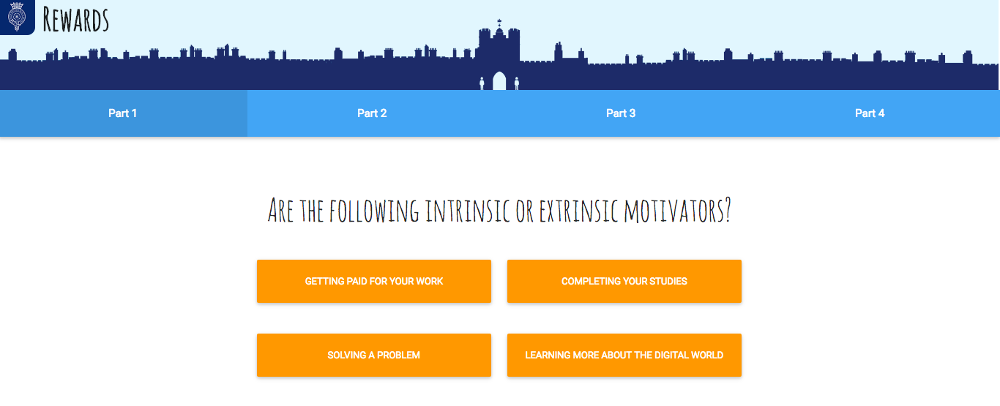

## Introduction

A single static webpage of a rewards badge quiz aimed at people aged 11-14, exploring how rewards change behaviour. I follow the current design, branding and content from [iDEA] (https://idea.org.uk/).



## Instructions

Click [here] (https://sity-rewards-badge.herokuapp.com/) to explore it online.

To install and use locally:
```
$ git clone git@github.com:sitypop/rewards-badge.git
$ cd rewards-badge
$ node bin/http-server
```
Then open your browser, visit `http://localhost:8080`.

## Tools used
* HTML
* CSS
* Materialize  
* JQuery

## Author
Sity Shah
